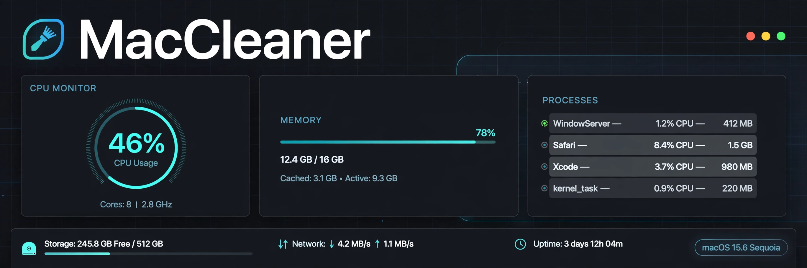

# MacCleaner

> ## Status: 🟢 Completed
>
> <progress value="90" max="100"></progress>
> **Progress: 90%** — The System tab (full task manager) is built and CI is green; the namesake Clean tab is still a placeholder and on-Mac visual check is unverified.

<p align="center">
  
</p>

[](https://swift.org)
[](https://developer.apple.com/macos/)
[](https://github.com/Geltrax69/mac_TaskManager/actions)

## What it is

A native macOS utility app (SwiftUI, built via XcodeGen, macOS 13+). Its flagship
feature is a **System tab** — a Task Manager / Activity Monitor-style process and
resource manager built directly into the app using only native macOS APIs
(`sysctl`, `libproc`, Mach). No shelling out, no mock data. The app's other
half, the Clean (storage cleaning) tab, is currently a placeholder.

## What works (verified)

- ✅ **Build + test on CI** — the latest CI run (2026-10-07, macOS 15) is **green**: `xcodegen generate`, `xcodebuild build`, and `xcodebuild test` all pass.
- ✅ **Live resource dashboard** (code-verified) — `MacOSSystemMonitor.sampleSystem()` reads RAM (total/used/available + swap kept separate), CPU utilization with logical/physical core counts, and the process list from `host_statistics64` / `host_processor_info`.
- ✅ **Process table** (code-verified) — `ProcessTableView` shows PID, CPU %, memory, status, user, path, with native sorting (memory descending by default), ⌘F search across name/PID/path/user, and a top-5 memory strip that selects the row in the table.
- ✅ **Details inspector** (code-verified) — `ProcessDetailView` shows parent PID, threads, nice value, architecture, command line (`KERN_PROCARGS2`), and clickable parent/children.
- ✅ **Safe termination** (code-verified) — `SystemViewModel` asks GUI apps to quit via `NSRunningApplication.terminate()`, `SIGTERM` otherwise, `SIGKILL` for force kill; confirmation dialog first, success reported only after `kill(pid, 0)` polling confirms exit; PID 0/1, other users' processes, and MacCleaner itself are locked.
- ✅ **Per-process CPU math matches Activity Monitor** (code-verified) — derived from `pti_total_user`/`pti_total_system` deltas; 100% = one fully-used core, so multithreaded processes can exceed 100%.
- ✅ **No TODOs / stubs** in the System tab code — `grep` for TODO/FIXME/XXX/stub returns nothing.
- ⚠️ **Cannot compile here** — this Linux VM has no Swift toolchain; verification above is CI + code reading. The app has never been launched by the author (visual feel unverified on a real Mac).

## Tech stack

| Area      | Choice |
|-----------|--------|
| Language  | Swift 5.9 |
| UI        | SwiftUI (macOS 13+) |
| Project   | XcodeGen (`project.yml`) — no checked-in `.xcodeproj` |
| Native APIs | `sysctl(KERN_PROC)`, `proc_pidinfo`, `proc_pidpath`, `host_statistics64`, `host_processor_info`, `kill(2)` |
| Testing   | XCTest — `FormatUtilsTests`, `ProcessQueryTests`, `MonitorValidationTests` |
| CI        | GitHub Actions on `macos-15`: install xcodegen → generate → build → test |

## How to run

> ⚠️ Requires a Mac. These commands were **not** run during the audit (no Swift
> toolchain in this Linux VM); they are the standard commands from the repo's
> CI and project files.

```sh
brew install xcodegen
xcodegen generate
open MacCleaner.xcodeproj
```

Then build & run (⌘R), and run tests with ⌘U or:

```sh
xcodebuild -scheme MacCleaner -destination 'platform=macOS' test
```

## Screenshots

No screenshots are checked into the repo — the banner above is the only visual.
The UI follows native macOS SwiftUI idioms (sidebar-style tabs, `Table` with
sortable columns, inspector pane), but no on-Mac screenshots exist yet.

## What you can add more

- [ ] **Clean tab for real** — the app is named MacCleaner but storage cleaning is a placeholder; add caches/logs/large-file scanning via `FileManager` enumeration.
- [ ] **On-Mac smoke test checklist** — verify the System tab against Activity Monitor after two refresh intervals (per-process CPU needs two samples; the first shows "—").
- [ ] **Network usage column** — per-process I/O counters via `PROC_PIDTASKINFO` net bytes.
- [ ] **Menu-bar companion** — lightweight CPU/RAM glance widget using the same `SystemMonitor` protocol.
- [ ] **Screenshots for the README** — capture the dashboard, table, and inspector on a real Mac.
- [ ] **Kill audit log** — record terminate/force-kill actions with timestamps in case a user kills the wrong process.

## Project structure

```
MacCleaner/
├── App/            # MacCleanerApp, ContentView (Clean + System tabs)
├── Models/         # ProcessSnapshot, MemoryInfo, CPUInfo, SystemSnapshot
├── Services/
│   ├── SystemMonitor.swift      # OS abstraction protocol + MonitorError
│   ├── MacOSSystemMonitor.swift # macOS implementation (sysctl/libproc/Mach)
│   └── FormatUtils.swift        # ByteCountFormatter / percent helpers
├── ViewModels/     # SystemViewModel (refresh loop, selection, termination flow)
├── Views/
│   ├── CleanTabView.swift       # placeholder — storage cleaning goes here
│   ├── Color+TertiaryLabel.swift
│   └── System/     # Tab, resource cards, process table, inspector, top-memory strip
├── Resources/      # Assets.xcassets
└── Info.plist
MacCleanerTests/    # XCTest: formatting, search/sort, validation, memory math
.github/workflows/ # CI: xcodegen → build → test on macos-15
```

---
*README written after code audit on 2026-10-08.*
